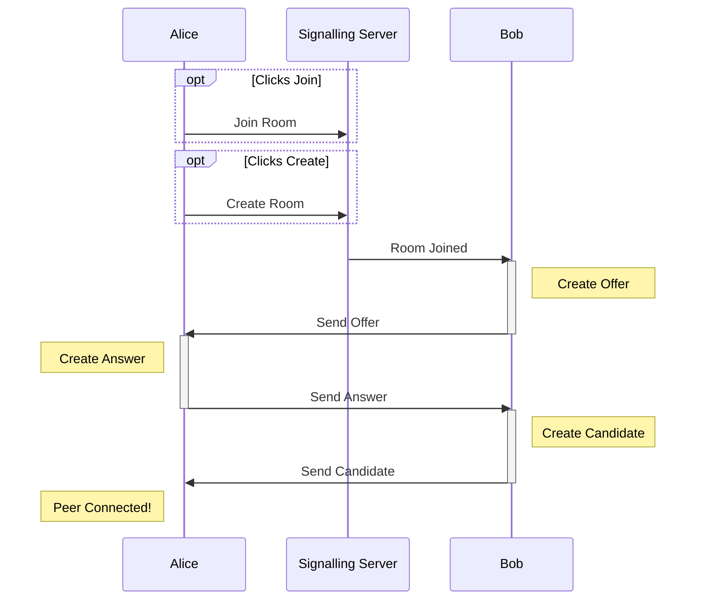

# Listening Party

Full-stack TypeScript app for a shared peer-to-peer music queue between friends. React frontend with state machines, docker-ised node backend with WebSocket signalling server for peer-to-peer WebRTC.

# What is this?
This web app lets users joins rooms and add songs to a shared queue. Users can search Spotify/Last.fm for songs to add to the queue.

Users can either just add songs and vote or also play music along with the room. ie. If you are in the same room/car you can join as a voter or if you are remote you can all listen to a synced music queue.

*A paid spotify account is required to play songs.*

# How does this work?
It uses the [WebRTC API](https://developer.mozilla.org/en-US/docs/Web/API/WebRTC_API) to faciliate peer-to-peer connections. The peers are connected in a mesh configuration where each peer has a seperate connection with each other peer, without a server.

Initially however, to create each peer-to-peer connection, an intemediary signalling server is used. 

Two peers, Alice and Bob, use an intemediary signalling server to facilitate a peer-to-peer connection. Signalling sequence diagram is shown below. The process requires the [signalling server](https://developer.mozilla.org/en-US/docs/Web/API/WebRTC_API/Signaling_and_video_calling) to resolve how to connect two peers over the internet.

Data between peers is sent through an [RTCDataChannel](https://developer.mozilla.org/en-US/docs/Web/API/RTCDataChannel), Media streams are not utilised.