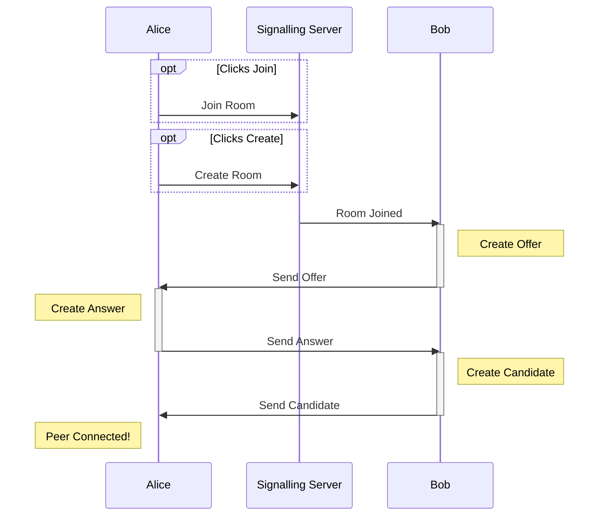

# Listening Party

Full-stack TypeScript app for a shared peer-to-peer music queue between you and your friends. React frontend with state machines, docker-ised node backend with WebSocket signalling server for peer-to-peer WebRTC.

## What is this?
This web app lets users joins rooms and add songs to a shared queue. Users can search Spotify for songs to add to the queue.

Users can either just add songs and vote or also play music along with the room. ie. If you are in the same room/car you can join as a voter or if you are remote you can all listen to a synced music queue.

*A paid spotify account is required to play songs.*

## What libraries does this use?
- React - For reactivity in the app
- XState - For global state management
- Chakra UI - As a component library
- Typescript - For type security
- Express 

## What services does this use?
- Spotify Webplayback API
- Render.com - Hosting of server docker container
- Vercel - Hosting frontend app

## How does it work?
It uses the [WebRTC API](https://developer.mozilla.org/en-US/docs/Web/API/WebRTC_API) for peer-to-peer connections. Data between peers is sent through an [RTCDataChannel](https://developer.mozilla.org/en-US/docs/Web/API/RTCDataChannel), Media streams are not utilised.The peers are connected in a mesh configuration where each peer has a seperate connection with each other peer, without a server. Although a SFU or other configuration may be more efficient for larger networks, since rooms are likely to be small and only data channel is used between peers (no video, no audio), a simple many-to-many mesh is sufficient.

Initially however, to facilitate the creation of each peer-to-peer connection, an intemediary signalling server is used. The signalling sequence diagram is shown below, showing two peers, Alice and Bob, making use of the signalling server to connect using WebRTC. The process requires the [signalling server](https://developer.mozilla.org/en-US/docs/Web/API/WebRTC_API/Signaling_and_video_calling) to resolve how to connect two peers over the internet. Once connected, the mesh does not need the signalling server to transfer data between peers, unlike a normal server-client app.

## Why?
For fun.

## How do I set this up myself?
1.
2.
3.
