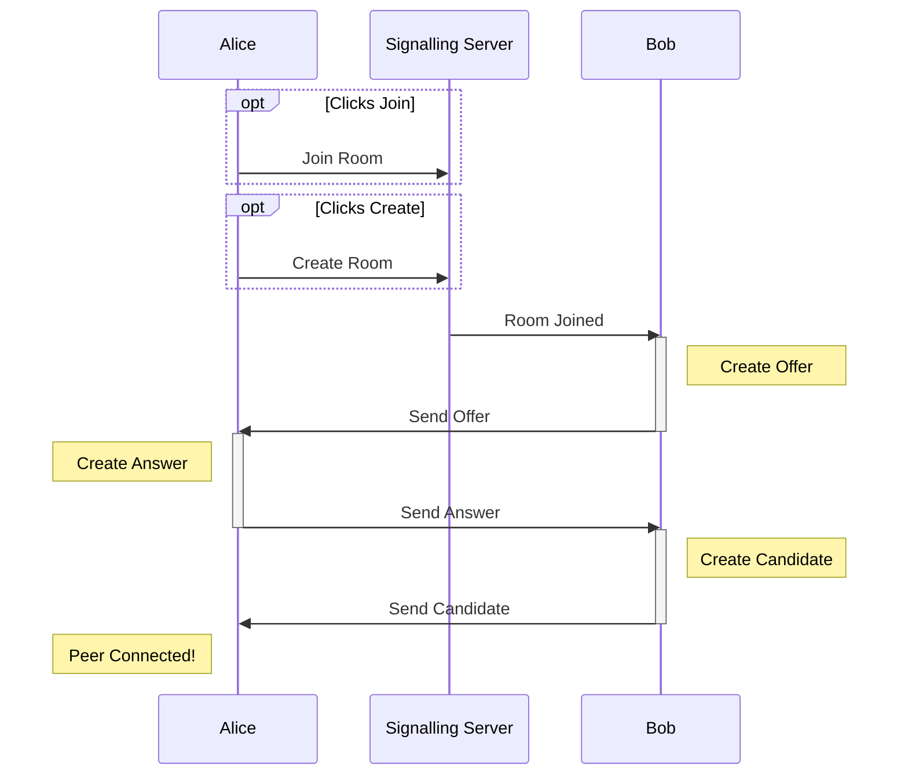

# Listening Party

Full-stack TypeScript app for a shared peer-to-peer music queue between you and your friends.

**NOTE:** This is a WIP project, many features will not work or have not been implemented yet.

### What is it?
This web app lets users joins rooms and add songs to a shared queue. Users can search Youtube (will eventually support other platforms) for songs to add to the queue.

Users can either just add songs and vote or also play music along with the room. ie. If you are in the same room/car you can join as a voter or if you are remote you can all listen to a synced music queue.

### Why?
Have you ever been in a car, at home, or in an office where everybody wants to listen and add songs to the queue?

This project is partly for fun and to show a production ready application.

## Project Overview
This monorepo contains all the code required to run Listening Party, it is split into 3 packages:
- `@listening-party/app` - SPA frontend
	- `React` - Front end reactivity framework
	- `Vite` - For development server and bundling application
	- `XState` - Controls global and local state with state machines
	- `Chakra UI` - Component library for UI elements
- `@listening-party/server` - Express and WebSocket Server for facilitating peer-to-peer connections between clients
- `@listening-party/core` - Shared code between `app` and `server`

All packages use:
- `TypeScript` - For development which is transpiled into JavaScript
- `ESLint` - Finds and fixes problems in code 
- `Prettier` - Automatically formats code to be consistent
- `Jest`/`Vitest` - For automatic unit testing
- `Husky` - Automatically runs linting, testing and formatting before commiting

The monorepo uses `pnpm` and `nx` to handle workspaces and internal dependencies between packages (since both the `app` and `server` depend on `core`). `nx` is also used to handle build, dev and test scripts.

### How does the P2P connection work?
It uses the [WebRTC API](https://developer.mozilla.org/en-US/docs/Web/API/WebRTC_API) for peer-to-peer connections. Data between peers is sent through an [RTCDataChannel](https://developer.mozilla.org/en-US/docs/Web/API/RTCDataChannel), Media streams are not utilised.The peers are connected in a mesh configuration where each peer has a seperate connection with each other peer, without a server. Although a SFU or other configuration may be more efficient for larger networks, since rooms are likely to be small and only data channel is used between peers (no video, no audio), a simple many-to-many mesh is sufficient.

Initially however, to facilitate the creation of each peer-to-peer connection, an intemediary signalling server is used. The signalling sequence diagram is shown below, showing two peers, Alice and Bob, making use of the signalling server to connect using WebRTC. The process requires the [signalling server](https://developer.mozilla.org/en-US/docs/Web/API/WebRTC_API/Signaling_and_video_calling) to resolve how to connect two peers over the internet. Once connected, the mesh does not need the signalling server to transfer data between peers, unlike a normal server-client app.

## Project Setup
### Prerequisites
- Make sure you have PNPM installed
- Have a Spotify Application
- Have a LastFM Application
- Have Docker installed

### Installation
1. Clone this repository using `git clone https://github.com/paullj/listening-party.git`
2. Run `pnpm install`

### Running
Run `pnpm dev` and navigate to the frontend endpoint in the terminal for development. This used `vite` and `nodemon` for the frontend and backend respectively

For building for production, use `pnpm build`

### Deploying
I use render.com but this should be deployable anywhere with Docker. The Dockerfile runs a build step and serves the frontend using an express server.

